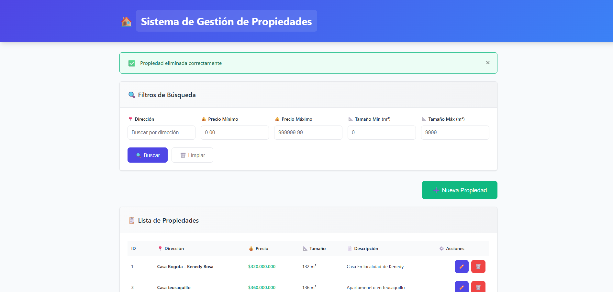
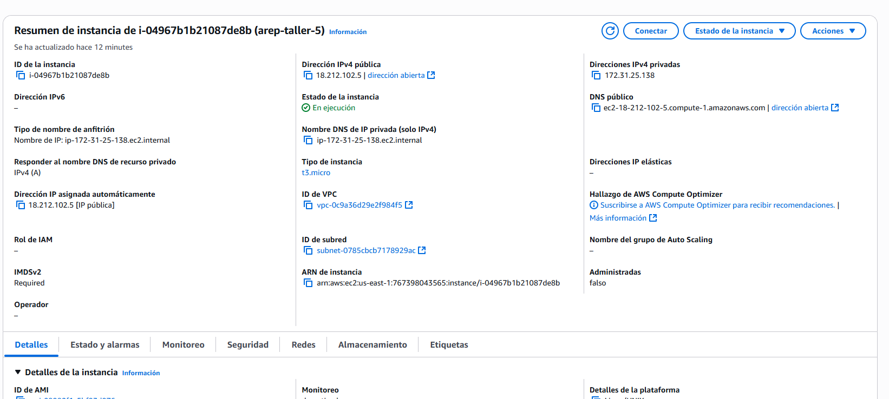
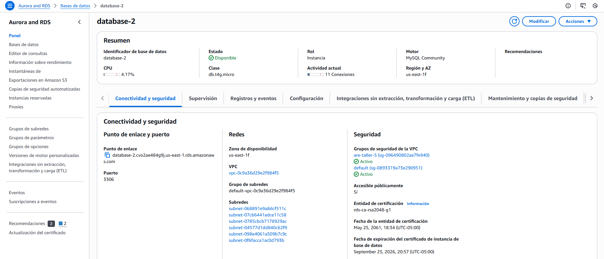

# 🏢 CRUD de Propiedades - Taller #5 AREP

**Autor:** Diego Cárdenas  
**Programa:** Arquitecturas Empresariales (AREP)  
**Taller:** #5  

Aplicación full-stack para administrar propiedades inmobiliarias desarrollada con Spring Boot, React y MySQL. Implementa operaciones CRUD completas con API REST, interfaz web moderna, paginación, filtros de búsqueda, validación de datos y manejo robusto de errores.

## 🔗 Enlaces Importantes

- **Video demostración:** <https://youtu.be/6f4BoBsoFVM>
- **Aplicación desplegada en AWS:** [Enlace al despliegue]

## 📸 Capturas del Despliegue

### Aplicación Web Funcionando

*Interfaz web de la aplicación CRUD de propiedades desplegada en AWS*

### Instancia EC2 en AWS

*Servidor EC2 donde está desplegada la aplicación Spring Boot*

### Base de Datos Aurora RDS

*Base de datos MySQL en AWS RDS para persistencia de datos*

## 📋 Tabla de Contenidos

- [Arquitectura del Sistema](#️-arquitectura-del-sistema)
- [Tecnologías Utilizadas](#️-tecnologías-utilizadas)
- [Estructura del Proyecto](#-estructura-del-proyecto)
- [Modelo de Datos](#️-modelo-de-datos)
- [API REST](#-api-rest)
- [Componentes Frontend](#️-componentes-frontend)
- [Instalación y Ejecución](#-instalación-y-ejecución)
- [Despliegue en AWS](#️-despliegue-en-aws)
- [Scripts de Base de Datos](#️-scripts-de-base-de-datos)
- [Funcionalidades Implementadas](#-funcionalidades-implementadas)
- [Implementaciones Adicionales](#️-implementaciones-adicionales)

## 🏗️ Arquitectura del Sistema

La aplicación sigue una arquitectura de **tres capas** con separación clara de responsabilidades:

```text
┌─────────────────┐    ┌─────────────────┐    ┌─────────────────┐
│   PRESENTACIÓN  │    │      LÓGICA     │    │      DATOS      │
│                 │    │    DE NEGOCIO   │    │                 │
│ Frontend React  │◄──►│ Spring Boot API │◄──►│   MySQL RDS     │
│    (Vite)       │    │      (REST)     │    │   (Persistencia)│
└─────────────────┘    └─────────────────┘    └─────────────────┘
```

### Componentes Principales

1. **Frontend (React + Vite)**
   - Single Page Application (SPA)
   - Interfaz de usuario responsiva
   - Validación del lado del cliente
   - Comunicación con API REST

2. **Backend (Spring Boot)**
   - API REST con endpoints CRUD
   - Validación de datos con Jakarta Bean Validation
   - Persistencia con Spring Data JPA
   - Manejo centralizado de excepciones

3. **Base de Datos (MySQL)**
   - Almacenamiento persistente
   - Índices optimizados para consultas
   - Esquema relacional normalizado

## 🛠️ Tecnologías Utilizadas

### Backend

- **Java 21** - Lenguaje de programación
- **Spring Boot 3.3.13** - Framework principal
- **Spring Web** - Desarrollo de API REST
- **Spring Data JPA** - Persistencia de datos
- **Jakarta Bean Validation** - Validación de datos
- **MySQL Connector/J** - Driver de base de datos
- **Maven** - Gestión de dependencias

### Frontend

- **React 18.3.1** - Biblioteca de interfaz de usuario
- **Vite 5.4.6** - Herramienta de construcción y desarrollo
- **JavaScript (ES6+)** - Lenguaje de programación
- **HTML5 & CSS3** - Marcado y estilos

### Infraestructura

- **MySQL 8** - Sistema de gestión de base de datos
- **Docker** - Contenedorización
- **AWS EC2** - Servidor de aplicación
- **AWS RDS** - Base de datos en la nube

## 📁 Estructura del Proyecto

```text
arep-taller-5/
├── backend/                              # Aplicación Spring Boot
│   ├── src/main/java/com/arep/properties/
│   │   ├── PropertiesApplication.java    # Clase principal Spring Boot
│   │   ├── controller/
│   │   │   └── PropertyController.java   # Controlador REST
│   │   ├── service/
│   │   │   └── PropertyService.java      # Lógica de negocio
│   │   ├── repository/
│   │   │   └── PropertyRepository.java   # Acceso a datos
│   │   ├── model/
│   │   │   └── Property.java            # Entidad JPA
│   │   └── exception/
│   │       └── GlobalExceptionHandler.java # Manejo de excepciones
│   ├── src/main/resources/
│   │   ├── application.properties        # Configuración Spring
│   │   ├── schema.sql                   # Script DDL de referencia
│   │   └── static/                      # Recursos estáticos (build React)
│   ├── Dockerfile                       # Imagen Docker
│   └── pom.xml                         # Dependencias Maven
├── frontend/                           # Aplicación React
│   ├── src/
│   │   ├── main.jsx                    # Punto de entrada React
│   │   └── ui/
│   │       └── App.jsx                 # Componente principal
│   ├── package.json                    # Dependencias npm
│   └── vite.config.js                 # Configuración Vite
├── docker-compose.yml                  # Orquestación de servicios
└── README.md                          # Documentación
```

## 🗃️ Modelo de Datos

### Entidad Property

La aplicación maneja una única entidad principal que representa las propiedades inmobiliarias:

```java
@Entity
@Table(name = "properties")
public class Property {
    @Id
    @GeneratedValue(strategy = GenerationType.IDENTITY)
    private Long id;                    // ID único autoincremental
    
    @NotBlank
    @Column(nullable = false)
    private String address;             // Dirección (requerida)
    
    @NotNull
    @DecimalMin(value = "0.0", inclusive = false)
    @Digits(integer = 15, fraction = 2)
    private BigDecimal price;           // Precio (requerido, > 0)
    
    @NotNull
    @Min(1)
    private Integer size;               // Tamaño en m² (requerido, > 0)
    
    @Column(columnDefinition = "TEXT")
    private String description;         // Descripción (opcional)
}
```

### Esquema de Base de Datos

```sql
CREATE TABLE properties (
    id BIGINT PRIMARY KEY AUTO_INCREMENT,
    address VARCHAR(255) NOT NULL,
    price DECIMAL(15,2) NOT NULL,
    size INT NOT NULL,
    description TEXT
);

-- Índices para optimizar consultas
CREATE INDEX idx_properties_address ON properties(address);
CREATE INDEX idx_properties_price ON properties(price);
CREATE INDEX idx_properties_size ON properties(size);
```

## 🔌 API REST

### Base Path: `/api/properties`

| Método | Endpoint | Descripción | Parámetros |
|--------|----------|-------------|------------|
| POST | `/` | Crear propiedad | Body: Property JSON |
| GET | `/` | Listar propiedades | Query: address, minPrice, maxPrice, minSize, maxSize, page, size |
| GET | `/{id}` | Obtener por ID | Path: id |
| PUT | `/{id}` | Actualizar propiedad | Path: id, Body: Property JSON |
| DELETE | `/{id}` | Eliminar propiedad | Path: id |

### Ejemplos de Uso

#### Crear una propiedad

```bash
POST /api/properties
Content-Type: application/json

{
    "address": "Calle 123 #45-67",
    "price": 250000000,
    "size": 120,
    "description": "Hermosa casa con jardín"
}
```

#### Listar propiedades con filtros

```bash
GET /api/properties?address=calle&minPrice=100000000&maxPrice=300000000&page=0&size=10
```

### Códigos de Respuesta

- **200 OK** - Operación exitosa
- **201 CREATED** - Recurso creado exitosamente
- **204 NO CONTENT** - Eliminación exitosa
- **400 BAD REQUEST** - Datos de entrada inválidos
- **404 NOT FOUND** - Recurso no encontrado
- **500 INTERNAL SERVER ERROR** - Error interno del servidor

## ⚛️ Componentes Frontend

### Estructura de Componentes

```javascript
App.jsx                     // Componente raíz
├── PropertyForm           // Formulario crear/editar
├── PropertyList          // Lista paginada de propiedades
├── PropertyCard          // Tarjeta individual de propiedad
├── SearchFilters         // Filtros de búsqueda
└── Pagination           // Controles de paginación
```

### Características del Frontend

1. **Validación en Tiempo Real**
   - Validación de campos requeridos
   - Validación de tipos de datos
   - Mensajes de error descriptivos

2. **Interfaz Responsiva**
   - Diseño adaptable a diferentes dispositivos
   - Grid CSS para layouts flexibles
   - Componentes reutilizables

3. **Gestión de Estado**
   - Hooks de React (useState, useEffect)
   - Estado local para formularios
   - Sincronización con API

## 🚀 Instalación y Ejecución

### Prerrequisitos

- **Java 21** o superior
- **Node.js 18+** y npm
- **Maven 3.8+**
- **MySQL 8** (local) o **Docker**

### Opción 1: Desarrollo Local (Recomendado)

#### 1. Clonar el repositorio

```bash
git clone <repository-url>
cd arep-taller-5
```

#### 2. Ejecutar con Docker Compose

```bash
# Crear archivo .env con variables de entorno
echo "SPRING_DATASOURCE_URL=jdbc:mysql://host.docker.internal:3306/arep_taller_5?createDatabaseIfNotExist=true&serverTimezone=UTC" > .env
echo "SPRING_DATASOURCE_USERNAME=root" >> .env
echo "SPRING_DATASOURCE_PASSWORD=yourpassword" >> .env

# Levantar servicios
docker-compose up --build
```

#### 3. Acceder a la aplicación

- **Frontend:** <http://localhost:8080>
- **API:** <http://localhost:8080/api/properties>

### Opción 2: Desarrollo Separado

#### Backend para desarrollo

```bash
cd backend
mvn spring-boot:run
```

#### Frontend para desarrollo

```bash
cd frontend
npm install
npm run dev
```

### Opción 3: Build de Producción

#### 1. Construir frontend

```bash
cd frontend
npm run build
cp -r dist/* ../backend/src/main/resources/static/
```

#### 2. Construir backend

```bash
cd backend
mvn clean package -DskipTests
java -jar target/properties-app-0.0.1-SNAPSHOT.jar
```

## ☁️ Despliegue en AWS

### 📷 Evidencias del Despliegue

La aplicación ha sido exitosamente desplegada en AWS utilizando los siguientes servicios:

#### Instancia EC2


*Servidor EC2 configurado con Docker ejecutando la aplicación Spring Boot*

#### Base de Datos RDS Aurora


*Base de datos MySQL Aurora RDS configurada para la persistencia*

#### Aplicación en Funcionamiento


*Interfaz web completamente funcional con operaciones CRUD*

### Arquitectura de Despliegue

```text
Internet → ALB → EC2 (Spring Boot) → RDS MySQL
                    ↓
               CloudWatch Logs
```

### 1. Base de Datos (RDS MySQL)

```bash
# Crear instancia RDS
aws rds create-db-instance \
    --db-instance-identifier arep-properties-db \
    --db-instance-class db.t3.micro \
    --engine mysql \
    --master-username admin \
    --master-user-password <secure-password> \
    --allocated-storage 20 \
    --vpc-security-group-ids sg-xxxxxxxx \
    --db-name arep_taller_5
```

### 2. Servidor de Aplicación (EC2)

#### Script de instalación en EC2

```bash
#!/bin/bash
# Instalar Docker
sudo yum update -y
sudo yum install -y docker
sudo service docker start
sudo usermod -a -G docker ec2-user

# Instalar Docker Compose
sudo curl -L "https://github.com/docker/compose/releases/download/v2.20.0/docker-compose-$(uname -s)-$(uname -m)" -o /usr/local/bin/docker-compose
sudo chmod +x /usr/local/bin/docker-compose

# Clonar repositorio
git clone <repository-url>
cd arep-taller-5

# Configurar variables de entorno
cat << EOF > .env
SPRING_DATASOURCE_URL=jdbc:mysql://<rds-endpoint>:3306/arep_taller_5?createDatabaseIfNotExist=true&serverTimezone=UTC
SPRING_DATASOURCE_USERNAME=admin
SPRING_DATASOURCE_PASSWORD=<secure-password>
EOF

# Levantar aplicación
docker-compose up -d --build
```

### 3. Configuración de Seguridad

#### Security Groups

```bash
# Backend Security Group
aws ec2 create-security-group \
    --group-name arep-backend-sg \
    --description "Security group for AREP backend"

# Permitir HTTP
aws ec2 authorize-security-group-ingress \
    --group-id sg-xxxxxxxx \
    --protocol tcp \
    --port 80 \
    --cidr 0.0.0.0/0

# Permitir puerto 8080
aws ec2 authorize-security-group-ingress \
    --group-id sg-xxxxxxxx \
    --protocol tcp \
    --port 8080 \
    --cidr 0.0.0.0/0
```

## 🗄️ Scripts de Base de Datos

### Script de Creación de Tabla

```sql
-- Script para crear la tabla de propiedades
-- Este script se ejecuta automáticamente por Hibernate con ddl-auto=update

CREATE TABLE IF NOT EXISTS properties (
    id BIGINT NOT NULL AUTO_INCREMENT,
    address VARCHAR(255) NOT NULL,
    price DECIMAL(15,2) NOT NULL,
    size INT NOT NULL,
    description TEXT,
    PRIMARY KEY (id)
);

-- Índices para optimizar rendimiento de consultas
CREATE INDEX IF NOT EXISTS idx_properties_address ON properties(address);
CREATE INDEX IF NOT EXISTS idx_properties_price ON properties(price);
CREATE INDEX IF NOT EXISTS idx_properties_size ON properties(size);

-- Datos de prueba (opcional)
INSERT INTO properties (address, price, size, description) VALUES
('Calle 123 #45-67, Bogotá', 250000000.00, 120, 'Casa moderna con jardín y garaje'),
('Carrera 15 #30-20, Medellín', 180000000.00, 85, 'Apartamento en zona residencial'),
('Avenida 68 #40-15, Bogotá', 320000000.00, 150, 'Casa esquinera con terraza'),
('Calle 10 #25-30, Cali', 150000000.00, 75, 'Apartamento cerca al centro'),
('Transversal 20 #12-45, Cartagena', 280000000.00, 110, 'Casa con vista al mar');
```

### Script de Configuración de Usuario

```sql
-- Crear usuario específico para la aplicación
CREATE USER IF NOT EXISTS 'arep_user'@'%' IDENTIFIED BY 'arep_password_2024';

-- Otorgar permisos necesarios
GRANT SELECT, INSERT, UPDATE, DELETE ON arep_taller_5.* TO 'arep_user'@'%';
GRANT CREATE, ALTER, INDEX ON arep_taller_5.* TO 'arep_user'@'%';

-- Aplicar cambios
FLUSH PRIVILEGES;

-- Verificar permisos
SHOW GRANTS FOR 'arep_user'@'%';
```

## ✅ Funcionalidades Implementadas

- ✅ **CRUD Completo** - Crear, leer, actualizar y eliminar propiedades
- ✅ **API REST** - Endpoints RESTful con códigos de estado HTTP apropiados
- ✅ **Validación de Datos** - Validación en frontend y backend
- ✅ **Paginación** - Lista paginada con controles de navegación
- ✅ **Filtros de Búsqueda** - Búsqueda por dirección, precio y tamaño
- ✅ **Manejo de Errores** - Mensajes de error amigables al usuario
- ✅ **Interfaz Responsiva** - Diseño adaptable a diferentes dispositivos
- ✅ **Contenedorización** - Aplicación dockerizada para fácil despliegue
- ✅ **Despliegue en AWS** - Infraestructura en la nube con RDS y EC2

## 🛠️ Implementaciones Adicionales

### 📚 Taller JPA (Spring Data JPA)

Como parte del laboratorio, se implementó un taller adicional de **Spring Data JPA** que demuestra el uso básico de persistencia de datos:

#### Estructura del Taller JPA

```text
taller-clase/tallerjpa/arep/
├── src/main/java/escuelaing/edu/co/arep/
│   ├── AccessingDataJpaApplication.java    # Aplicación principal
│   ├── Customer.java                       # Entidad JPA
│   └── CustomerRepository.java             # Repositorio de datos
```

#### Componentes Implementados

1. **Entidad Customer** (`Customer.java`)

```java
@Entity
public class Customer {
    @Id
    @GeneratedValue(strategy = GenerationType.AUTO)
    private Long id;
    private String firstName;
    private String lastName;
    
    // Constructor y métodos...
}
```

2. **Repositorio** (`CustomerRepository.java`)

```java
public interface CustomerRepository extends CrudRepository<Customer, Long> {
    List<Customer> findByLastName(String lastName);
    Customer findById(long id);
}
```

3. **Aplicación Principal** (`AccessingDataJpaApplication.java`)
   - Implementa `CommandLineRunner` para demostración
   - Operaciones CRUD básicas
   - Consultas personalizadas por apellido
   - Logging de operaciones

#### Funcionalidades Demostradas

- **Persistencia automática** con H2 en memoria
- **Operaciones CRUD** básicas (Create, Read, Update, Delete)
- **Consultas derivadas** (`findByLastName`)
- **Inyección de dependencias** con Spring Boot
- **Logging de operaciones** para seguimiento

### ☁️ AWS CLI - Implementación de Infraestructura

Se documentó el proceso completo de configuración de infraestructura AWS usando **AWS CLI**:

#### Scripts y Comandos Implementados

1. **Configuración de Security Groups**

```bash
# Crear Security Group
aws ec2 create-security-group --group-name my-sg-cli --description "Security group for AREP lab"

# Autorizar acceso RDP (Puerto 3389)
aws ec2 authorize-security-group-ingress --group-id sg-092e0a16ae764a97b --protocol tcp --port 3389 --cidr 0.0.0.0/0

# Autorizar acceso SSH (Puerto 22)
aws ec2 authorize-security-group-ingress --group-id sg-092e0a16ae764a97b --protocol tcp --port 22 --cidr 0.0.0.0/0
```

2. **Creación de Instancia EC2**

```bash
# Lanzar instancia EC2
aws ec2 run-instances \
    --image-id ami-0b09ffb6d8b58ca91 \
    --count 1 \
    --instance-type t2.micro \
    --key-name MyKeyPair \
    --security-group-ids sg-092e0a16ae764a97b \
    --subnet-id subnet-068891e9a8dcf511c
```

#### Configuración de Infraestructura

- **AMI**: `ami-0b09ffb6d8b58ca91` (Amazon Linux)
- **Tipo de instancia**: `t2.micro` (Free Tier)
- **VPC**: `vpc-0c9a36d29e2f984f5`
- **Subnet**: `subnet-068891e9a8dcf511c`
- **Security Group**: `sg-092e0a16ae764a97b`
- **Key Pair**: `MyKeyPair`

#### Resultados del Despliegue

- **Instance ID**: `i-00c8394b95029197c`
- **DNS público**: `ec2-54-144-27-224.compute-1.amazonaws.com`
- **IP privada**: `172.31.40.204`
- **Zona de disponibilidad**: `us-east-1a`

### 🎯 Objetivos de Aprendizaje Alcanzados

1. **Spring Data JPA**
   - Configuración de entidades JPA
   - Implementación de repositorios
   - Consultas personalizadas
   - Integración con Spring Boot

2. **AWS CLI**
   - Gestión de Security Groups
   - Lanzamiento de instancias EC2
   - Configuración de redes y subnets
   - Automatización de despliegue

3. **Integración Práctica**
   - Combinación de desarrollo local y despliegue en nube
   - Documentación de procesos de infraestructura
   - Evidencia práctica del funcionamiento

---

**Desarrollado por:** Diego Cárdenas  
**Universidad:** Escuela Colombiana de Ingeniería Julio Garavito  
**Materia:** Arquitecturas Empresariales (AREP)  
**Año:** 2025
